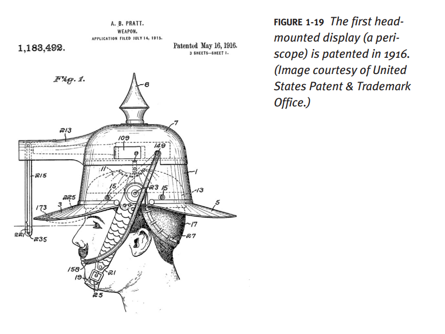
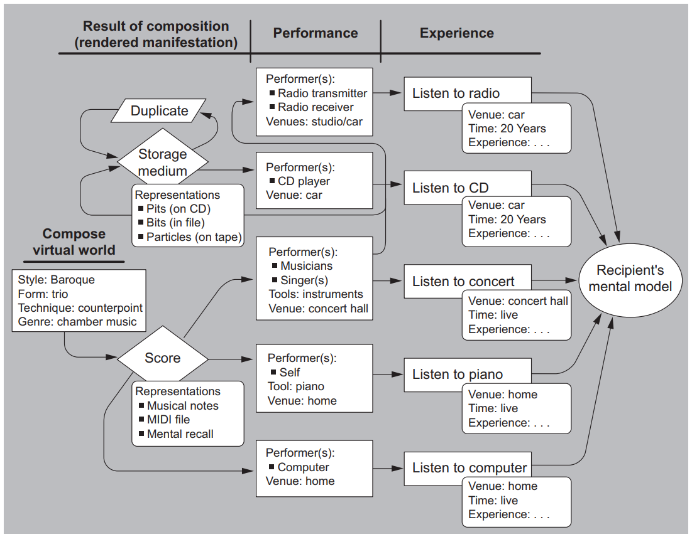
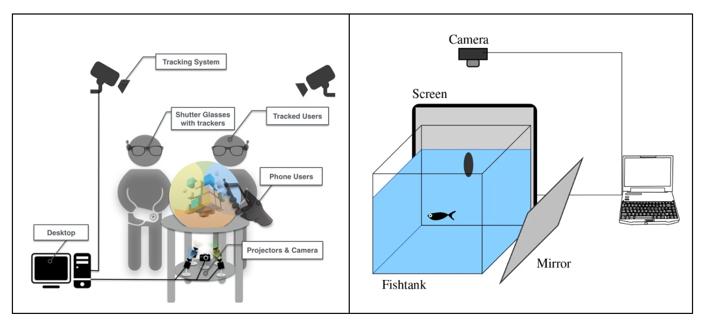
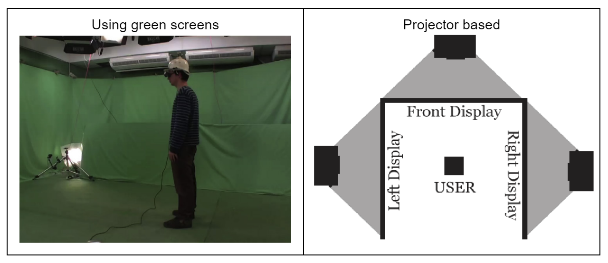
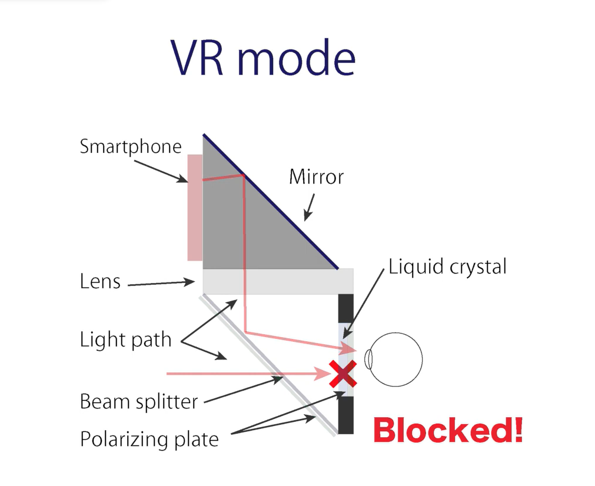
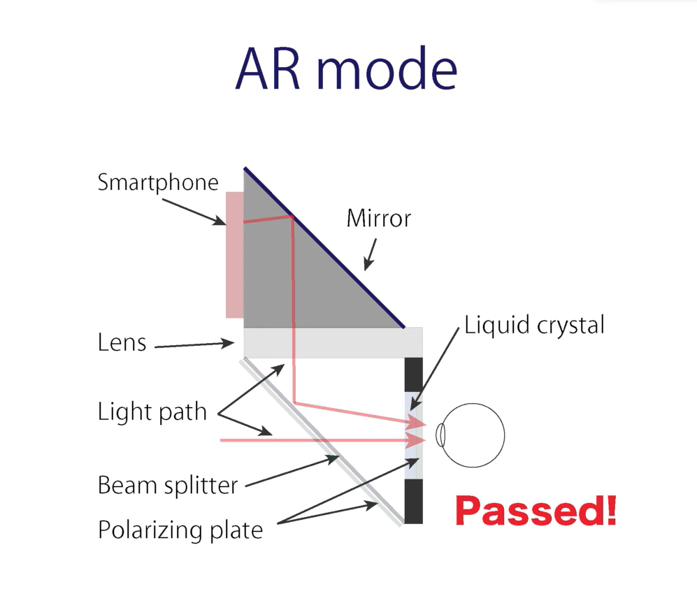
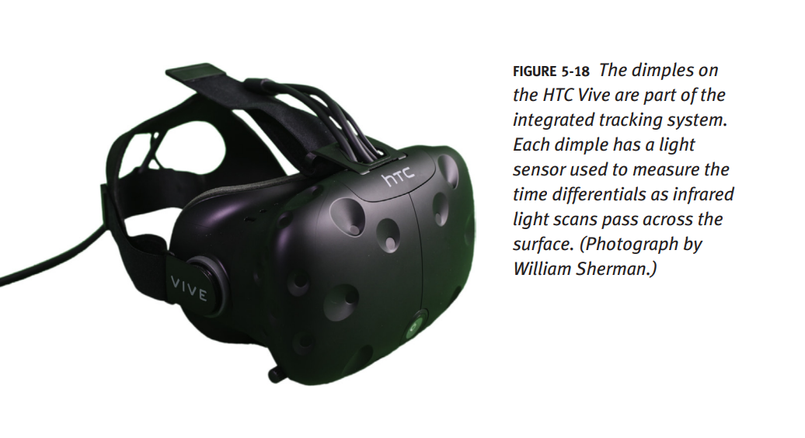
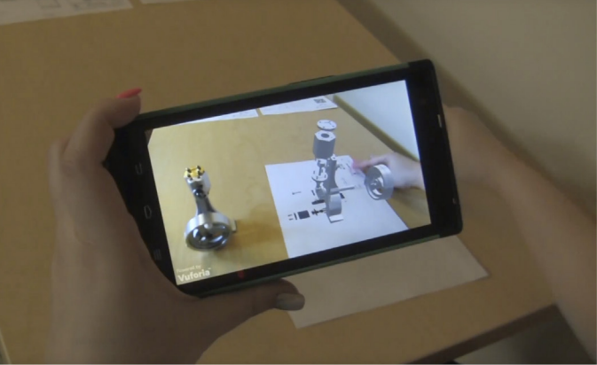
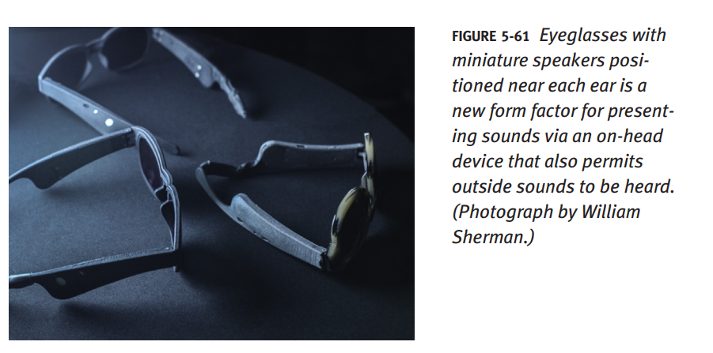

### Index
  * [Evolution of VR](#evolution-of-vr)  
  * [Essential Components of VR](#essential-components-of-vr) 
    * Hardware
    * Software  
  * [Types of VR Displays](#types-of-vr-displays) 
    * Visual
    * Aural  

---  

## Evolution of VR

In 1915, a [**US Patent 1,183,492**](https://patents.google.com/patent/US1183492A/en) was awarded to _Albert B. Pratt_ for a **head-based periscope display** (shown below).  

  

An overview of the VR conceptualization can be understood with the following flow diagram:  

  

---  

## Essential Components of VR

The components for virtual reality could be broadly categorized into the following two parts:  

> 1. Hardware
> 2. Software

### 1. Hardware

It may consist of: 

* Displays
* Sensors
* Audio-Visual rendering and capture 
* Interfacing Unit(s)

  

### 2. Software

* Calibration Methods
* IDEs and Toolkits _(for development)_
* Algorithms _(for object tracking, scene rendering, etc.)_
* Protocols _(for data storage, 3D object generation, communication in VE)_ 

A few such software solutions (but not limited) are _A-frame, D3.js, Three.js, and Unity._ 

  

---  

## Types of VR Displays  

There are two types:  

> 1. [Visual Displays](#visual-displays)
> 2. [Aural Displays](#aural-displays)

### Visual Displays

The visual displays are further categorized among three types based on the placement and hardware setup. These three types are:  

> 1. Stationary Displays
> 2. Head-based Displays
> 3. Hand-based Displays

Here we discuss each of these displays in more detail:  

#### Stationary Displays

**a. Fishtank VR Display**

A concise summary of Fish Tank VR displays could be considered as per the following 4-points:  

* **Enchanting 3D visualization:** Fish Tank VR displays offer a captivating way to visualize 3D data by projecting it onto a large, transparent screen, allowing users to explore and interact with data in an immersive manner.  
* **Enhanced depth perception:** Stereoscopic imaging employed by Fish Tank VR displays creates a realistic sense of depth, enabling users to grasp the 3D structure of data more effectively.  
* **User-friendly and accessible:** Fish Tank VR displays are relatively affordable and straightforward to use, making them a suitable option for a diverse range of applications.  
* **Limited field of view:** Though Fish Tank VR displays provide an immersive experience, they typically have a restricted field of view, which can pose a challenge when visualizing the entire dataset simultaneously.  

The following two images are taken from the research paper titled [_Design and implementation of a multi-person fish-tank virtual reality display_](#references), where authors describe the design and working of the fishtank VR display.    

  

**b. Surround VR Display**

The following images are taken from the research paper titled [_A comparative pilot study of historical artifacts in a CAVE automatic virtual reality environment versus paper-based artifacts_](#references). Here, authors observe the properties of CAVE automatic virtual reality environment, surround VR display.  

  

Surround VR displays could be summarized as below:  

* Wider field of view for a more immersive experience
* Reduced motion sickness for a more comfortable experience
* Higher resolution for sharper details
* More comfortable design for longer wear
* More expensive than traditional VR headsets

#### Head-based Displays

These are classified into four types. Here, 2 are solely categorized based on the role of natural light in content rendering.  

**a. Occlusive HBDs**

> * 3-DoF
> * Seated arrangement 
> * Generally consist of a joystick for hand inputs
> * Sometimes mouse/keyboards are also provided with such displays
> * Used in VR mode

**b. Non-occlusive HBDs**  

These are also termed as _optical see-through_ or _video see-through_ displays.  

> * Can provide both 3-DoF
> * Partially augment reality
> * Enables the user to see the real world as well
> * Used in AR mode

**c. Head-Mounted Projective Display**  

The patent for the first instance of a Head-Mounted Projective Display _(HMPD)_ was filed by [_James Fergason_](https://en.wikipedia.org/wiki/James_Fergason) in 1994. Finally, he was awarded the [**US Patent 10,495,859**](https://patents.google.com/patent/US10495859B2/en) for _"Head-mounted projection display using reflective microdisplays"_ in 1997.  

An HMPD _(figure below)_ has the following:  

> * Retro-reflective screen  
> * Pair of projectors
> * A pair lens

**d. Smartphone-VR Display**  

These are also termed as _optical see-through_ or _video see-through_ displays.  

> * Provides 6-DoF
> * Accommodates Smartphones

#### Hand-based Displays

**a. Handheld VR/AR**  

> * Provides 6-DoF
> * Highly Mobile
> * Limited Immersive Interaction

  

#### Properties of Visual Displays  

The following table gives overall information about the _visual-presentation_ and _logistic_ properties of visual displays:  

| Visual Presentation Properties | Logistic Properties            |
| ------------------------------ | ------------------------------ |
| Emitting technology            | Donning the apparatus          |
| Color                          | User mobility                  |
| Spatial resolution             | Interface with tracking methods|
| Contrast                       | Light pollution                |
| Brightness                     | Environment requirements       |

### Aural Displays

Aural displays focus on using sound and audio to enhance the immersive experience. Here are some key features and properties presented in bullet list markdown format:

> * Sound is a **composition of pressure waves** (traveling through air, water, metal, etc.)
> * Generated by vibrations/perturbations of the air 
> * Sound travels at about **340m/s** in the air
> * Human ears can process sound in the range of **20 to 22,000Hz**
> * Doubling the range to **22 to 44kHz** provides a minimal sampling rate that properly covers the entire range of possible human hearing ([Nyquist’s sampling theorem](https://en.wikipedia.org/wiki/Nyquist%E2%80%93Shannon_sampling_theorem))

  

At this point, we should also consider the basic anatomy of the human ear, as discussed in previous modules.

  

Now, equipped with this basic knowledge, let's proceed with the discussion about the types of aural displays. These are also categorized into three types: 

> 1. Stationary Displays
> 2. Head-based Displays
> 3. Hand-based Displays

Here we discuss each of these displays in more detail:  

### Aural Displays

Aural displays focus on using <u>sound and audio</u> to enhance the immersive experience. They can be categorized into three types:

#### 1. Stationary Displays 

**a. Speakers**  

> * Works well with stationary visual displays.
> * Does not require sound processing to create a world-referenced sound stage (i.e., one that remains stable to the virtual world).
> * Greater user mobility.
> * Little encumbrance.
> * Multiuser access means faster throughput.

#### 2. Head-based Displays (HBDs)

Some of the key features of these displays include:  

> * Works well with head-coupled visual displays.
> * Easier to implement spatialized 3D sound fields.
> * Masks real-world noise.
> * Greater portability with privacy.

**a. Closed-ear Headphones**  

These are also called _closed-ear aural displays_ as the speakers often cover the complete ear, largely blocking the outer noise from the real environment.  

  

**b. Open-ear Headphones**  

These are called _open-ear and near-ear speakers_. Due to being comparatively smaller, these speakers don't cover the complete ear, rather cover it partially.  

#### 3. Hand-based Displays

Some of the most common properties of these aural displays include: 

> * World-referenced sound stage with instant spatialization.
> * Works well as a combination with stationary or open-ear HBDs.
> * Pre-built in hand-held devices (mobile phones).

**a. Interaction Controller Device**  
**b. Smartphone/Tablet Mobile AR**  

> * Provides aural interaction in mobile Augmented Reality (AR).
> * Enhances the immersive experience on smartphones or tablets.

#### Properties of Aural Displays  

The following table provides overall information about the _aural-presentation_ and _logistic_ properties of aural displays:  

| Aural Presentation Properties  | Logistic Properties            |
| ------------------------------ | ------------------------------ |
| Sound stage (grounding)        | Noise pollution                |
| Localization                   | User mobility                  |
| Number of display channels     | Interface with tracking methods|
| Masking                        | Environment requirements       |
| Amplification                  | Associability with other sense displays |
| Latency tolerance              | Portability                    |
|                                | Throughput                     |
|                                | Encumbrance                    |
|                                | Safety                         |
|                                | Cost                           |

Having covered the introductory section of Virtual Reality, we can now delve into the module that explores the [_Technical Components_](../#technical-components) of VR.  

---  

#### References  

1. Steven M. LaValle, **“VIRTUAL REALITY,”** 2020 [[access online](http://lavalle.pl/vr/)]  
2. Display technologies for Augmented and Virtual Reality, [[blog](https://www.wevolver.com/article/display-technologies-for-augmented-and-virtual-reality)]  
3. Dylan B. Fafard et al., **"Design and implementation of a multi-person fish-tank virtual reality display,"** 2018 [[PDF](https://dl.acm.org/doi/pdf/10.1145/3281505.3281540)]  
4. Sujan Shrestha et al., **"A comparative pilot study of historical artifacts in a CAVE automatic virtual reality environment versus paper-based artifacts,"** 2016 [[PDF](https://dl.acm.org/doi/pdf/10.1145/2957265.2962644)]  

---  

[🔙 Module-1 Home Page](../)