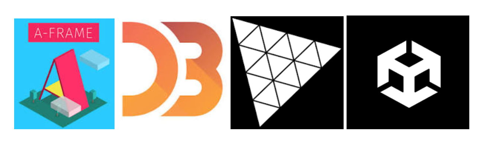

# Introduction  

### Index
  * [Evolution of VR](#evolution-of-vr)  
  * [Essential Components of VR](#essential-components-of-vr) 
    * Hardware
    * Software  
  * [Types of VR Displays](#types-of-vr-displays) 
    * Visual
    * Aural  

#### References  

1. Steven M. LaValle, **“VIRTUAL REALITY,”** 2020 [access online](http://lavalle.pl/vr/)  
2. Display technologies for Augmented and Virtual Reality, [blog](https://www.wevolver.com/article/display-technologies-for-augmented-and-virtual-reality)

---  

## Evolution of VR

In 1915, a [**US Patent 1,183,492**](https://patents.google.com/patent/US1183492A/en) was awarded to _Albert B. Pratt_ for a **head-based periscope display**.  _(shown below)_  

  

An overview of the VR conceptualization can be understood with the following flow diagram:  

  

---  

## Essential Components of VR

The components for virtual reality could be broadly categorized into the following two parts:  

> 1. Hardware
> 2. Software

### 1. Hardware

It may consist of: 

* Displays
* Sensors
* Audio-Visual rendering and capture 
* Interfacing Unit(s)

  

### 2. Software

* Calibration Methods
* IDEs and Toolkits _(for development)_
* Algorithms _(for object tracking, scene rendering, etc.)_
* Protocols _(for data storage, 3D object generation, communication in VE)_ 

A few such software solutions (but not limited) are _A-frame, D3.js, Three.js, and Unity._ 

  

---  

## Types of VR Displays  

There are two types:  

> 1. [Visual Displays](#visual-displays)
> 2. [Aural Displays](#aural-displays)

### Visual Displays

The visual displays are further categorized among three types based on the placement and hardware setup. These three types are:  

> 1. Stationary displays
> 2. Head-based displays
> 3. Hand-based displays

Here we discuss each of these displays in more detail:  

#### Head-based Displays

These are classified into four types. Here, 2 are solely categorized based on the role of natural light in content rendering.  

**a. Occlusive HBDs**

> * 3-DoF
> * Seated arrangement 
> * Generally consist of a joystick for hand inputs
> * Sometimes mouse/keyboards are also provided with such displays
> * Used in VR mode

**b. Non-occlusive HBDs**  

These are also termed as _optical see-through_ or _video see-through_ displays.  

> * Can provide both 3-DoF
> * Partially augment reality
> * Enables the user to see the real world as well
> * Used in AR mode

**c. Head-Mounted Projective Display**  

The patent for the first instance of a Head-Mounted Projective Display _(HMPD)_ was filed by [James Fergason](https://en.wikipedia.org/wiki/James_Fergason) in 1994. Finally, he was awarded the [**US Patent 10,495,859**](https://patents.google.com/patent/US10495859B2/en) for _"Head-mounted projection display using reflective microdisplays"_ in 1997.  

An HMPD _(figure below)_ has the following:  

> * Retro-reflective screen  
> * Pair of projectors
> * A pair lens

**d. Smartphone-VR Display**  

These are also termed as _optical see-through_ or _video see-through_ displays.  

> * Provides 6-DoF
> * Accomodates Smartphones

#### Hand-based displays

**a. Handheld VR/AR**  

> * Provides 6-DoF
> * Highly Mobile
> * Limited Immersive Interaction

  

<!-- ### Aural Displays -->