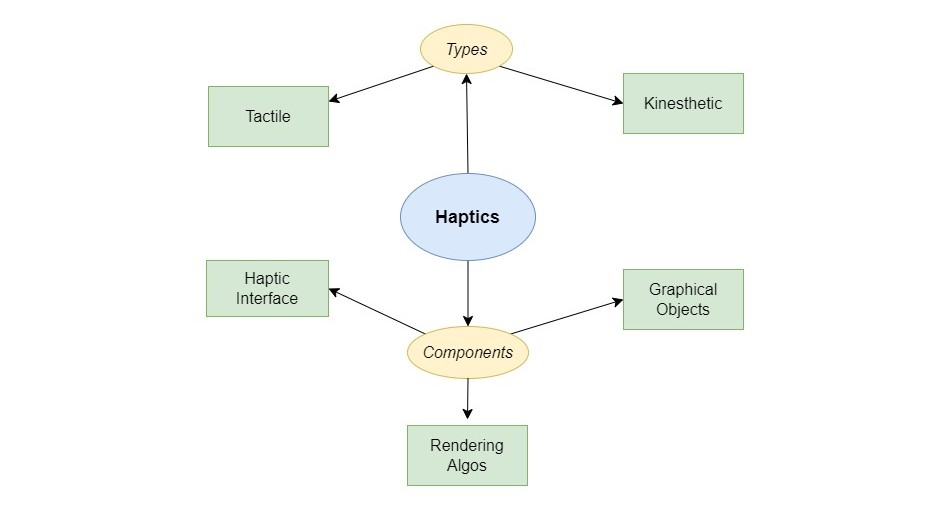
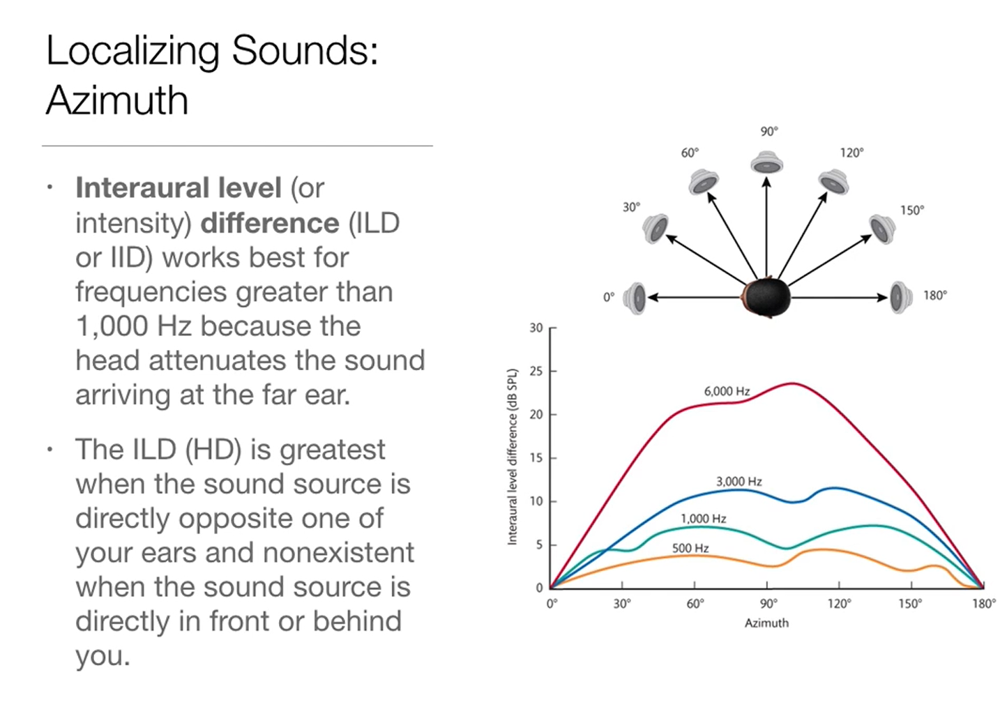

# Technical Components - I

### Index
  * [Rendering in Virtual World](#rendering-in-virtual-world)  
    * Haptic Representation
    * Aural Representation
  * [Rendering Systems](#rendering-systems)

---  

## Rendering in Virtual World

The representation of various content in the virtual world is possible due to different rendering techniques dedicated to specific types of renderers. The following figure gives an overview of the same with respect to an immersed participant:  

There are two main types of representations in the virtual world:

> 1. [Haptic Representation](#haptic-rendering)
> 2. [Aural Representation](#aural-rendering)  

### Haptic Rendering

**TL;DR**  
> * based on friction-induced vibrations
> * tactile rendering device - used to recreate the perception of textures from a distance
> * consists of electro-active polymer **actuator** as key components
> * **pre-recorded vibrational stimulus** (by actuators) are regenerated in VE for immersiveness

In virtual reality (VR), **haptic rendering** refers to the simulation of the sense of touch through the use of haptic feedback technologies. It involves generating tactile sensations, such as vibrations or forces, to replicate the feel of virtual objects or interactions within a virtual environment. Haptic rendering enhances the overall immersive experience in virtual reality by providing users with a sense of touch and interaction with the virtual world.  

In brief, the idea of haptic rendering is based on friction-induced vibrations, a tactile rendering device used to recreate the perception of textures from a distance, consisting of electro-active polymer actuators as key components, and pre-recorded vibrational stimuli (by actuators) are regenerated in VE for immersiveness.

The process largely depends on two factors:

> 1. Contact Information  
> 2. Force Estimation  

**Contact Information:**

* Collision Detection & Response
* Visuals - Force shading and polishing
* Contact Impedance - contact to the surface (pressure and direction of force)
* Friction parameters
* Texture of Surface

**Force Estimation:** 

The _lateral-force gradient algorithm_ can be a suitable algorithm. 

* Use texture (height field) to encode surface details
* Directional penetration depth

Let's discuss the complete process of Haptic Rendering in Detail. 

#### Haptics Rendering Algorithms

  

We will focus on rendering algorithms here.

As introduced in the introduction to [Haptic Rendering](#haptic-rendering), there is a sequence of steps involved in it. We'll quickly explore them, one by one:  

**Collision Detection:**  

Here are the key points to be considered:  

> - Pipeline (shown above)
> - **Methods:**
>   1. Haptic Colloid _(3 parts)_
>      - Surface Decomposition _(3D objects)_
>   2. Sensation Preserving Simplification
>      - Multiresolution Representation 
>   3. **Collision Handling Concepts**

**Collision Handling:**  

It provides feedback after collision. It can be typically of two types:  

> 1. Penalty Based
>    - Good for Simple (surface) Objects
> 2. Constraint Based
>    - Upgraded (minimum proxy)

#### Force Model Based Rendering

Something about Force Model Based Rendering is described. The force model based rendering system depends on the two main factors:

> 1. Surface Properties  
> 2. Force Shading

Here we elaborate on these in a few bullet points:  

1. **Surface Properties:**
    - _Normal_
      - Force normal to the surface

    - _Contact Impedance_
      - On user’s interaction
      - Resistive in nature
      - Perpendicular
      - Often represented with <u>Spring & Viscous Damping Force</u>

    - _Friction_
      - Inertial Friction
      - Resistive Friction
      - Role of Torque

    - _Texture_
      - 3 Ways of Representation
      - Virtual Surface Information
      - Stochastic Process
2. **Force Shading:**
    - For direction and other properties

#### Stochastic Surface Modeling

As it makes sense, haptic rendering highly depends on the type of surface as well. This is why surface modeling is equally important in this complete process.  

The _stochastic surface modeling_ is a process to achieve this that uses Stochastic Modeling to estimate the roughness. As the property of roughness:

* Waviness should be removed first
* Can use filter

Following approach is used to remove the waviness from the surface [_[image credit]_](https://www.youtube.com/watch?v=hOL8wnoJtfY&t=1448s):  

Now based on the collision on the different surface (varying in terms of texture) and the force applied, the contact force can be modeled. Following the formulation of contact force, i.e., response, for haptic rendering:

### Aural Rendering

We'll start with _aural rendering_ by looking onto the key takeayaws from two of the previously emerged research works.   

The article, titled [_"Audio in VR: Effects of a Soundscape and Movement-Triggered Step Sounds on Presence"_](#references), highlights:  

> * Ambient soundscapes and movement-triggered step sounds can improve presence in VR.
> * The soundscape has a larger effect on presence than step sounds.
> * Audio rendering is an important part of creating a VR experience.
> * **Positioning:**
>     * Non-localizable sounds, such as the **ambient nature soundscape**, might NOT be assigned to any particular location.
>     * **Footstep sounds** could be positioned in space by assigning them to the right and left **foot of the avatar**.
> * All sounds were provided in stereophonic WAVE format and compressed to the Vorbis format.
> * The sampling rate was preserved at **44.1 kHz**.  

Another recent work (published in 2022) titled [_"On the Relative Importance of Visual and Spatial Audio Rendering on VR Immersion"_](#references) suggests that:  

> * **Ambient soundscapes** and **movement-triggered step sounds** can improve presence in VR.
> * The **soundscape has a larger effect** on presence than step sounds.
> * Audio rendering is an important part of creating a VR experience.

Now, let's delve into a more detailed discussion of aural rendering!

#### Audio 

While talking about the audio in technical terms, followinf points should be considered:  

* A user listening through speakers or headphones impacts sound source localization.
* Consider position, orientation, tracking, and avatar locomotion for auralization.
* The Doppler Effect serves as a significant motion cue in audio.
* The Ventriloquism Effect is when visuals influence the localization of a sound source or shift it elsewhere than the actual location.
* Visuals must be in sync with sound (or earlier).
* Simplify geometric models for audio, often requiring a spatial resolution of 0.5 meters.

#### Audio Cues

* Auditory localization is akin to depth perception in vision.
* Cues involve one ear (monaural) or both ears (binaural).

1. **Monaural Cues:**

   * Monaural cues rely on sounds reaching one ear.
   * Spherical coordinates (azimuth, elevation, radius) describe auditory source points.

     

   * Azimuth is the angle in the xz plane; elevation/altitude is the interior angle in a vertical triangle.
   * Radius is the distance from the origin to the source.

     

2. **Binaural cues:** 
  > - **Credit for Content:** The acknowledgment for various images featured in this segment is attributed to the video [_Perception: 10.2 - Localizing Sounds_](https://youtu.be/Mi3Guybisxw?si=uNoq2ERSlXYx6xg-) by [**Dr. Kristin Atchison**](https://youtu.be/Mi3Guybisxw?si=F3eRXo2JwrqYPnDd).  

  * Binaural cues for localization involve both ears.
  * Interaural Level Difference (ILD) is a simple binaural cue based on differences in sound magnitude between ears.

  

  * Interaural Time Difference (ITD) depends on the time it takes for sound to reach each ear, with a distance of approximately 21.5cm between ears (longest at 90 deg.).

  

  * ITD creates a hyperboloid known as the cone of confusion, representing possible source locations.

  

  * ILD and ITD collectively can help localize the sound source (e.g., made unequal by tilting the head).
  * The outer ear also pinpoints the sound to locate the source. The brain narrows down the cone of confusion using the known arrival time difference, aided by pinna distortions. 

#### Auditory Rendering 

An overview of _auditory rendering_ can be understood from the following diagram.  

Let's try to understand the involved audio signal processing, step-wise!

#### Basic Signal Processing
	
* **Sampling rates:** 
  - Nyquist sampling i.e. twice a frequency cycle
* **Linear filters:**
  - for Signal transformation
  - Satisfies 2 algebraic properties:  
    + 1) Additive: F(x + x′) = F(x) + F(x′)
    + 2) Homogeneous: cF(x) = F(cx)  (c is constant)
  - These properties are collectively used to manipulate waves by joining and scaling the amplitude.
* **Finite Impulse Response _(FIR)_:**
  - Impulse: Single sample with value 1 (x[0] = 1), with infinite 0 (x[k > 0] = 0)
  - Response received on passing the impulse signal through the filter
* **Nonlinear filters:** 
  - Don’t follow the mentioned 2 algebraic properties
* **Returning to Fourier Analysis**
* **Transfer Function**

Here is a sample code for FIR that also demonstrates two types of filters with it:  

Notice the kind of output's phase and impulse response in different cases _(above)_ how the type of filter affects the same. 

##### Acoustic Modeling

As per the paper - [_"Immersive Virtual Reality Teaching in Colleges and Universities Based on Vision Sensors"_](#references), a broad-level overview is given about the requirements of different renderings.  

**Geometric Modeling for Auditory VR:**

> * Similar geometric models for visual rendering can be used for auditory modeling.
> * High visual acuity doesn't matter as much for audio.
> * **Challenge:** Converting a detailed 3D model optimized for visuals into one suitable for auditory rendering.

**Sound Source in Virtual Environment:**  

> * The sound source can be a point emitting sound waves or a vibrating planar surface.
> * The equivalent of white light in sound is white noise, practically having a concentration in specific frequencies.

**Interaction of Sound with Surfaces:**  

> * Analogous to the shading problem in visual rendering (Section 7.1).
> * Large, smooth surfaces result in the in/out angle equality.
> * Altered amplitude in reflection due to absorption into the material.
> * For smaller objects/surfaces with repeated structures, sound waves may scatter.

**Modeling Challenges:**  

> * Significant scattering may occur if wavelength is close to the structure size.
> * Bidirectional scattering distribution function (BSDF) could be constructed but faces challenges in handling diverse surface structures.

**Sound Capture:**  

> * In the real world using microphones and brought into the virtual world.
> * Challenges in fully capturing the sound field; proposed techniques involve the interpolation of sounds captured by multiple microphones.

**Practical Considerations:**  

> * Fine details in geometric models for visuals can be simplified for rendering.
> * Absorption coefficients for materials are available at different frequencies.
> * Difficulties in modeling and calculating scattering patterns for sound waves.

#### Auralization 

In virtual reality (VR) settings, when we talk about the auralization of sound insulation between adjacent rooms, we're essentially simulating how sound travels between these spaces. This process uses methods to predict sound insulation, ensuring a realistic and high-quality auditory experience within the virtual environment.  

* **Sound Propagation in VE**
  - Pressure before Obstacle
  - Pressure after scattering factor accounting
  - Scattering components _(difference between previous 2 cases)_ 
* **Wave Propagation**
  - Numerical vs Visibility-based
  - Cases to use which of the 2 (above) when
* **Ear Entry and Tracking**
  - It is represented as if virtual ears are positioned in the virtual environment, effectively mirroring the real ears for listening.
  - To ensure synchronization:
    + The microphone is treated as an ear.
    + Sound adjustments are made based on the user's head repositioning.
  - Consequently, tracking the ear's pose (both position and orientation) becomes essential for establishing the appropriate "viewpoint." This parallels head tracking, involving straightforward adjustments in position and orientation for both the right and left ears.
    + There are two options: _**1)** track head orientation while noting ear positions, **2)** Perform full-body pose tracking, directly capturing the poses of the ears._

---  

## Rendering Systems

The **rendering system** is a crucial component of any VR system, responsible for generating the images that are displayed on the user's headset. It must be able to do this efficiently and accurately to provide a smooth and immersive VR experience.

### Key Challenges

VR rendering faces several challenges, including:

1. **Low Latency:** VR requires the rendering system to produce images at a very low latency, typically in the order of milliseconds. This is because any delay between the user's head movement and the corresponding change in the image can cause motion sickness or other unpleasant side effects.
2. **High Frame Rate:** VR also requires the rendering system to produce images at a high frame rate, typically around 90 frames per second (FPS) or higher. This is because a lower frame rate can lead to perceived judder or stuttering, which can also cause discomfort.
3. **Retina-Level Resolution:** VR headsets typically have very high resolutions, often referred to as retina-level resolution. This means that the individual pixels on the display are too small to be seen by the human eye, resulting in a sharp and clear image.
4. **Accurate Perspective and Shading:** The rendering system must also be able to accurately render the perspective and shading of objects in the virtual world. This means that objects must appear to be the correct size and shape, and that they must be lit and shadowed correctly.

A more detailed discussion is provided on the page having article [_"From rendered image to switching pixels"_](#references). Let's explore the components of VR rendering system.

### Components of the VR Rendering System

The VR rendering system consists of several key components:  

* **Virtual World Generator (VWG):** The VWG is responsible for managing the virtual world, including the positions and orientations of all objects. It must be able to update the world state at a rate that is consistent with the desired frame rate.

* **Visual Rendering System:** The visual rendering system is responsible for taking the current state of the virtual world and generating an image that can be displayed on the user's headset. This involves several steps, including:

    1. **Perspective and Viewport Transformations:** These transformations convert the 3D coordinates of objects in the virtual world into 2D coordinates on the screen.

    2. **Rasterization:** Rasterization converts the 2D coordinates of objects into pixels on the screen. This involves calculating the color of each pixel based on the object's material properties, lighting, and other factors.

    3. **Display:** The display is the final stage of the rendering pipeline and is responsible for displaying the generated image to the user.

#### Synchronization of VWG and Rendering System

Synchronization between the VWG and rendering system is crucial to avoid tearing artifacts on the screen. Tearing occurs when the image is updated while the lines are being scanned out, causing the image to appear torn or broken.

Vsync (pronounced "vee sink") is a technique used to synchronize the rendering system with the display's refresh rate. It prevents the video memory from being written outside of the vblank interval, which is the period when the display is not actively displaying an image.

**Latency Reduction Methods**

Latency reduction is essential for a comfortable VR experience. Several techniques can be used to reduce latency, including:  

1. **Forward Rendering:** Forward rendering processes each scene element in the order it appears to the viewer, minimizing the need for data backtracking and improving rendering efficiency.
2. **Asynchronous Reprojection:** Asynchronous reprojection predicts the user's head movement and adjusts the rendered image accordingly, reducing the perceived latency between head movement and image updates.
3. **Eye Tracking:** Eye tracking can focus rendering resources on the areas of the scene the user is looking at, improving performance and reducing overall latency.

### Summary of Rendering System  

VR rendering is a complex and evolving field, continuously striving to deliver the most immersive and comfortable VR experiences. By addressing the challenges mentioned above and exploring new techniques, VR rendering can continue to push the boundaries of virtual reality.

---  

#### References  

1. Steven M. LaValle, **"VIRTUAL REALITY,"** 2020 [[access online](http://lavalle.pl/vr/)]  
2. William R. Sherman et al., **"Understanding Virtual Reality,"** 2018 [[PDF](https://drive.google.com/file/d/1N4GNZFMVCjRYew58dXQjSBIKYhuUZXhu/view?usp=drive_link)]
3. Dangxiao Wang et al., **"Haptic display for virtual reality: progress and challenges,"** 2019 [[online](https://www.sciencedirect.com/science/article/pii/S2096579619300130)]  
4. Angelika C. Kern et al., **"Audio in VR: Effects of a Soundscape and Movement-Triggered Step Sounds on Presence,"** 2020 [[online](https://www.frontiersin.org/articles/10.3389/frobt.2020.00020/full)]  
5. Thomas P. et al., **"On the Relative Importance of Visual and Spatial Audio Rendering on VR Immersion,"** 2022 [[online](https://www.frontiersin.org/articles/10.3389/frsip.2022.904866/full)]  
6. Thomas P. et al., **"Immersive Virtual Reality Teaching in Colleges and Universities Based on Vision Sensors,"** 2022 [[online](https://www.researchgate.net/publication/357865319_Immersive_Virtual_Reality_Teaching_in_Colleges_and_Universities_Based_on_Vision_Sensors)]  
7. From rendered image to switching pixels [[blog](https://lavalle.pl/vr/node219.html)]  

---  

[🔙 Module-3 Home Page](../)