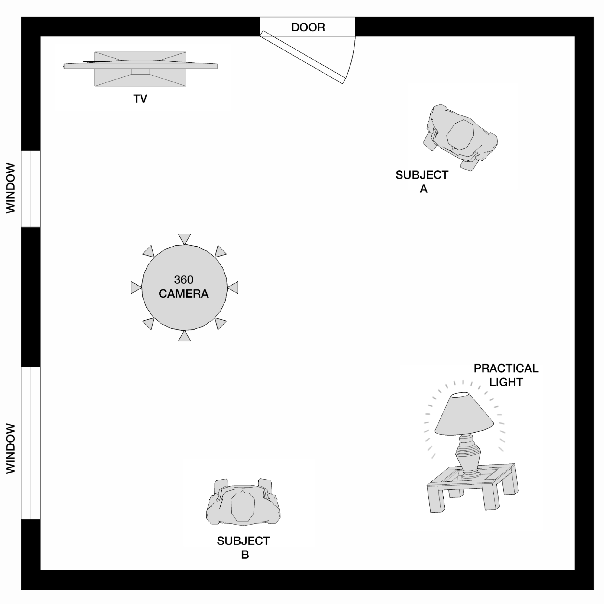
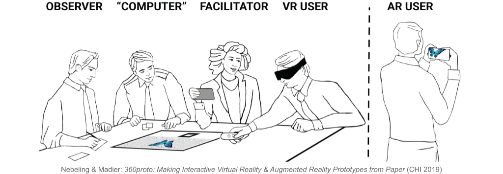

# Case Studies  

## Index
* [Design and Evaluation](#design-and-evaluation)  
* [Production Pipeline](#production-pipeline)  
  * Sensing  
  * Rendering  
  * Mobile, Stand-alone, and High-end Computing Platforms 

---  

## Design and Evaluation

### Design 

- AR/VR
- Flow
- UI
- Backend and integration technologies

### Evaluation

- Ease of access
- Dependencies 
- Security
- Scope and Usability

---  

## Production Pipeline

### General Pipeline

1. Selection of problem
2. Based on the R-V Continuum, finalize the suitable solution
3. Sorting dependencies
4. Production
  - Sensing
  - Rendering
5. Adaptability _etc..._

The production of Immersive Reality typically consists of several steps and processes. Three of such most essential processes include:  

1. Sensing
2. Rendering
3. High-end computing platforms

#### Sensing

During the sensing process, the devices are set up and calibrated to synthesize the information the most efficiently. This information can be:  

- Audio
- Image/Video
- Haptic Sensations _etc.._

The sensed information is then ready for processing and further operations.  

#### Rendering

It involves the presentation of different information to the end user. Depending upon the type of information, the rendering can be done in many ways. It can be:  

- Aural rendering
- Visual rendering
- Haptic rendering _etc..._

As discussed, the cruciality, volume, and dependency of and over the information may vary as per the use cases; it’s important to note the requirement to make the rendering compatible for various devices ranging from mobile phones to smart HMDs.  

### XR Video Production 

The 360 VR production requires sequential steps to write, plan, staff, and cast the VR solution.

#### Writing & Planning

- Native thinking is the art of composing content with the unique capabilities of XR in writing.  
- Consider/use space as a scope of understanding the user's behavior.  
- Location scouting is a crucial consideration. Before getting into production, practice 360 shots should be taken.  
- Due to distant background objects, it’s very important to consider the placement of objects, characters, and plot details while writing and planning.  
- Production Tools (for 360):  
  - Guiding cues: No cuts, zooms, and camera movements.  
  - Audio cues are sound elements designed to draw the audience's attention.  
  - Visual cues  
  - Point of Interest, or POI is the viewer’s area of attention.  
  - Camera movements, lightening, and colors.  
  - Text and graphic overlays  
  - The Authoring tools are also categorized into 5 classes based on the complexity and compatibility of ideas and devices, respectively. [paper](http://michael-nebeling.de/publications/ismar18adj.pdf)  

#### Production Preparation

**Storyboarding and Prototyping**  

* The storyboard should be a **representation of how the video will unfold,** it’s typically a series of thumbnails that illustrate key scenes, environments, and production elements with notes. 

**Overhead Diagrams & Blocking Shots**  

  

- Strategic Scene Mapping  
- Stitching Awareness  
- Quality Boost with Overheads  
- Prototyping can also be split among many levels. Broadly we can categorize it into 2 parts [paper](http://michael-nebeling.de/publications/chi18a.pdf):  
  - Physical Prototyping
  - Digital Prototyping 

  

---  

#### References  

<!-- 1. Frank Dellaert, **"Square root SAM,"** 2005 [[online](https://www.researchgate.net/publication/221344652_Square_root_SAM)]    
2. **Digital Guide - IONOS,** last accessed December 2023 [[website](https://www.ionos.co.uk/digitalguide/)]
3. **Paninian,** (online), last accessed December 2023 [[website](https://www.paninian.com/airvoxels-digitaltwin)] -->

---  

[🔙 Module-3 Home Page](../)